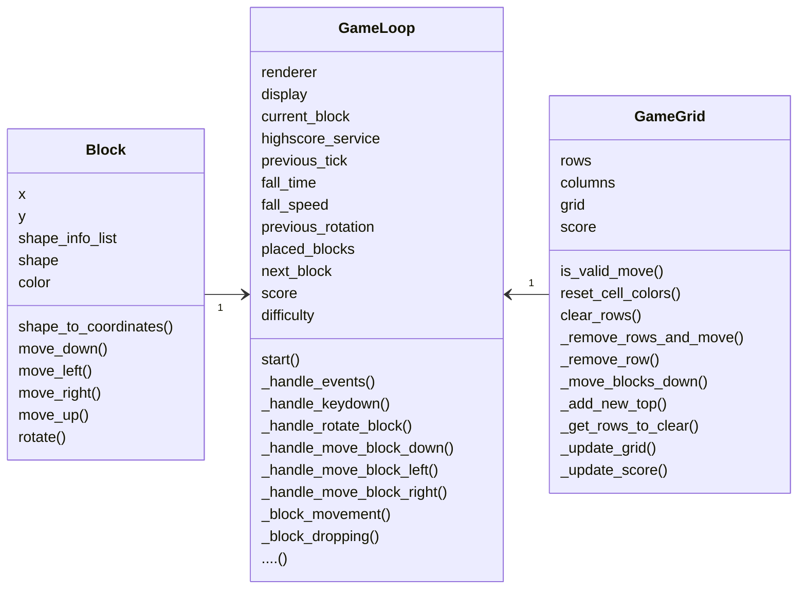
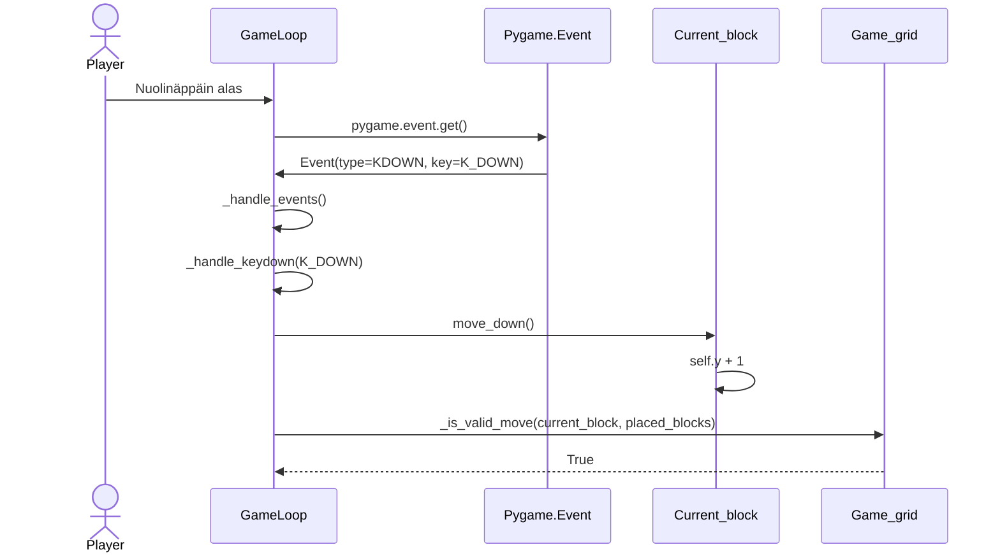

# Arkkitehtuurikuvaus

## Pakkauskaavio

Rakenne noudattaa pääsäntöisesti kolmitasoista kerrosarkkitehtuuria ja sovelluksen kannalta oleellisten pakkauksien pakkausrakenne on alla oleva:

Sovelluslogiikan kannalta oleelliset tiedostot sijaitsevat src sekä services kansiossa, kun taas repositories vastaa pysyväistallennuksesta. Database kansio sisältää tiedostot tietokantayhteyden muodostamiseen ja luomiseen.

## Sovelluslogiikka

Sovelluksen loogisen tietomallin muodostavat luokat Block, GameGrid sekä GameLoop. Block -luokka kuvastaa yksittäistä palikkaa pelin ruudukossa GameGrid. GameLoop vastaa pelisilmukan pyörittämisestä. GameLoopilla voi olla luonnollisesti vain yksi peliruudukko ja palikka käsittelyssä (current_block). GameLoop käsittelee varsinaisesti Renderer -luokassa sijaitsevaa ilmentymää GameGrid luokasta. Tämä tehtiin alunperin vain ruudukon piirtämisen helpottamiseksi. Luokkakaaviossa GameLoop -luokka on hieman yksinkertaistettu metodien/funktioiden suhteen sillä niitä on varsin monta.

## Sekvenssikaavio tilanteesta jossa käyttäjä siirtää palikkaa alas

Kun käyttäjä siirtää ensiksi palikkaa alas validilla siirrolla tapahtumaketju etenee seuraavasti:

Käyttäjä aloittaa painamalla nuolinäppäintä alas. Tämä vastaavasti laukaisee GameLoopissa sijaitevan tapahtumankäsittelijäkutsun Pygame kirjastossa sijaitsevalle moduulille Event. Event-moduuli palauttaa vastauksena annetun tyypin sekä avaimen ja muutaman muun oleellisen tiedon. Tässä tapauksessa type = KDOWN, key = K_DOWN. Tämä taas laukaisee GameLoopin sisäisen tapahtumankäsittelijän, jonka avulla käsitellään sekä näppäimen alaspainaminen että varsinainen näppäin (joka tässa tapauksessa siis oli nuolinäppäin alas). Tämän jälkeen GameLoop kutsuu Block -luokan ilmentymän current_block metodia move_down(), joka vastaavasti kasvattaa current_blockin y arvoa yhdellä. Lopuksi GameLoop kutsuu Renderer -luokassa sijaitsevaa ilmentymää GameGrid -luokasta metodikutsulla _is_valid(current_block, placed_blocks). Kun siirto on todettu validiksi, GameGrid palauttaa arvon True, jolloin muuta ei tehdä.

## Tietojen pysyväistallennus

Tiedon pysyväistallenuksesta vastaa repositories pakkauksessa sijaitseva luokka highscore_repository. Tiedot tallennetaan SQLite-tietokantaan. Tallennettu data on varsin yksinkertaista, sillä pelin on rakenteeltaan sellainen että se ei vaadi monimutkaista tietokantakäsittelyä. Tietokannan tauluun highscores tallennetaan id sekä sitä vastaava pistemäärä - josta ne sitten voidaan noutaa.
