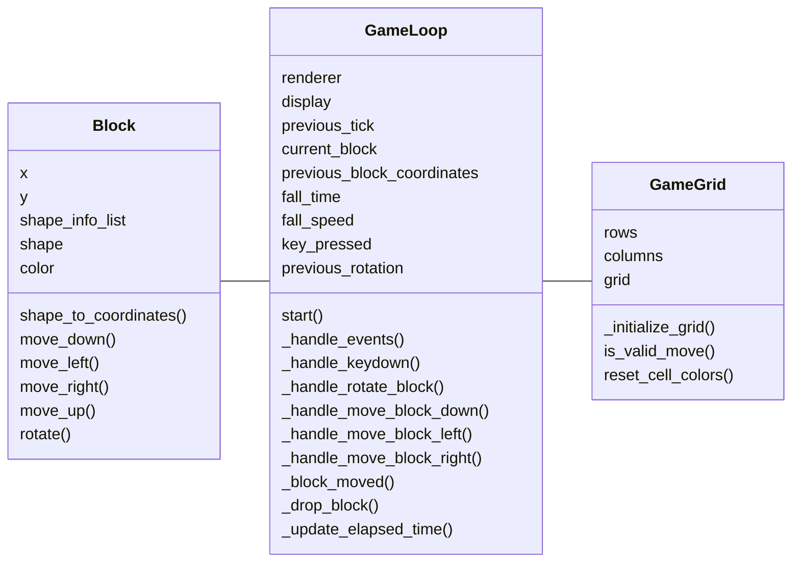
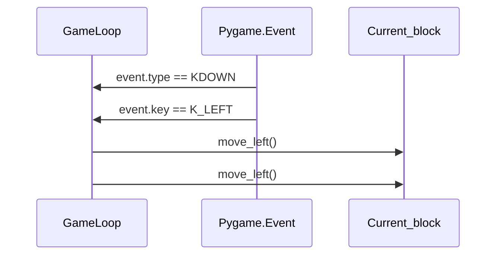

# Arkkitehtuurikuvaus

## Sovelluslogiikan luokkakaavio

## Sekvenssikaavio

Yksinkertaistettu tilanne palikan siirrosta vasemmalle. GameLoop luokka saa Pygame -kirjaston tapahtumajonosta komennot KDOWN, K_LEFT. Tämä vastaavasti laukaisee metodikutsun move_left() Block -luokan olion ilmentymälle current_block. Palikan x-arvoa lasketaan yhdellä. Muut siirrot toteutetaan samaan tapaan - paitsi rotaatio, jossa suoritetaan palikan kuviomatriisin transponointi. Näppäimistön kautta tapahtuvat siirrot ovat mahdollisia vain jos palikka ei ole siirto hetkellä tippumassa eli kun is_dropping palauttaa arvon False.

