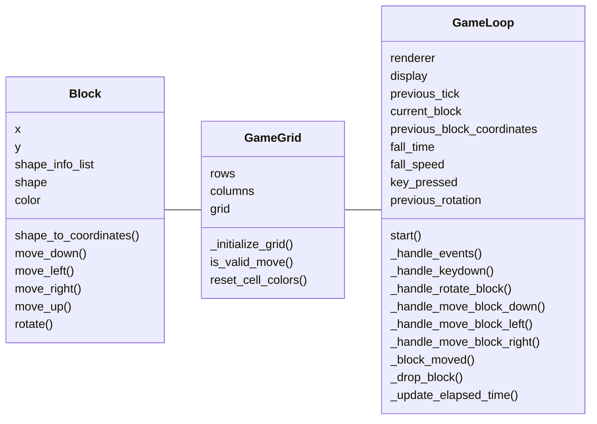

# Arkkitehtuurikuvaus

## Sovelluslogiikan luokkakaavio

```mermaid

 classDiagram
 
 direction LR
 
      Block -- GameGrid
      GameGrid -- GameLoop
      
      
      class Block{
      x
      y
      shape_info_list
      shape
      color
      shape_to_coordinates()
      move_down()
      move_left()
      move_right()
      move_up()
      rotate()
      }
      
      class GameGrid{
      rows
      columns
      grid
      _initialize_grid()
      is_valid_move()
      reset_cell_colors()
      }
      
      class GameLoop{
      renderer
      display
      previous_tick
      current_block
      previous_block_coordinates
      fall_time
      fall_speed
      key_pressed
      previous_rotation
      start()
      _handle_events()
      _handle_keydown()
      _handle_rotate_block()
      _handle_move_block_down()
      _handle_move_block_left()
      _handle_move_block_right()
      _block_moved()
      _drop_block()
      _update_elapsed_time()
      }
      
```
