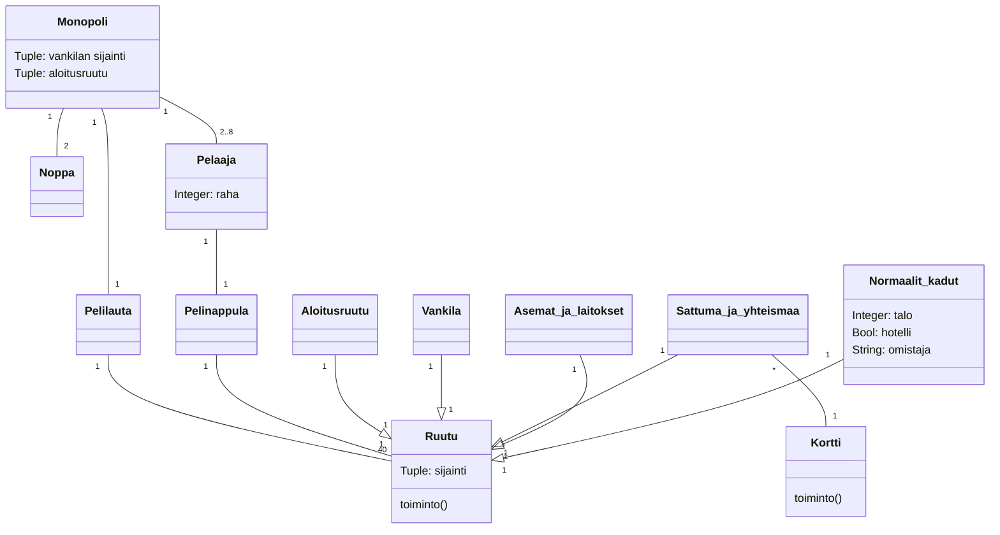

```mermaid
 classDiagram
      Monopoli "1" -- "2" Noppa
      Monopoli "1" -- "2..8" Pelaaja
      Monopoli "1" -- "1" Pelilauta
      Pelilauta "1" -- "40" Ruutu
      Pelaaja "1" -- "1" Pelinappula
      Pelinappula "1" -- "1" Ruutu
      Aloitusruutu "1" --|> "1" Ruutu
      Vankila "1" --|> "1" Ruutu
      Sattuma_ja_yhteismaa "1" --|> "1" Ruutu
      Sattuma_ja_yhteismaa "*" -- "1" Kortti
      Asemat_ja_laitokset "1" --|> "1" Ruutu
      Normaalit_kadut "1" --|> "1" Ruutu
 
      class Noppa{
      }
      class Monopoli{
      Tuple: vankilan sijainti
      Tuple: aloitusruutu
      }
      class Pelaaja{
      Integer: raha
      }
      class Pelilauta{
      }
      class Pelinappula{
      }
      class Ruutu{
      Tuple: sijainti
      toiminto()
      }
      class Aloitusruutu{
      }
      class Vankila{
      }
      class Sattuma_ja_yhteismaa{
      }
      class Asemat_ja_laitokset{
      }
      class Normaalit_kadut{
      Integer: talo
      Bool: hotelli
      String: omistaja
      }
      class Kortti{
      toiminto()
      }
```
