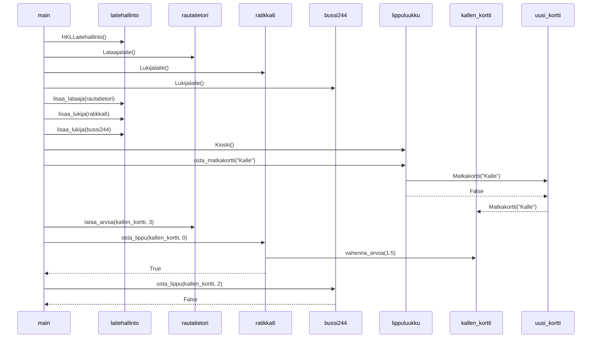

```mermaid
sequenceDiagram 
  participant main
  participant laitehallinto
  participant rautatietori
  participant ratikka6
  participant bussi244
  participant lippuluukku
  participant kallen_kortti
  participant uusi_kortti
  main->>laitehallinto: HKLLaitehallinto()
  main->>rautatietori: Lataajalaite()
  main->>ratikka6: Lukijalaite()
  main->>bussi244: Lukijalaite()
  main->>laitehallinto: lisaa_lataaja(rautatietori)
  main->>laitehallinto: lisaa_lukija(ratikka6)
  main->>laitehallinto: lisaa_lukija(bussi244)
  main->>lippuluukku: Kioski()
  main->>lippuluukku: osta_matkakortti("Kalle")
  lippuluukku->>uusi_kortti: Matkakortti("Kalle")
  lippuluukku-->>uusi_kortti: False
  uusi_kortti-->>kallen_kortti: Matkakortti("Kalle")
  main->>rautatietori: lataa_arvoa(kallen_kortti, 3)
  main->>ratikka6: osta_lippu(kallen_kortti, 0)
  ratikka6->>kallen_kortti: vahenna_arvoa(1.5)
  ratikka6-->>main: True
  main->>bussi244: osta_lippu(kallen_kortti, 2)
  bussi244-->>main: False
```
